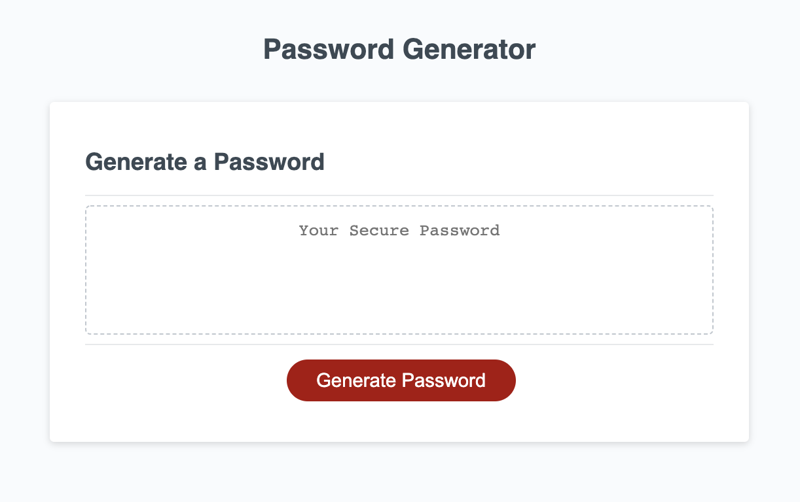
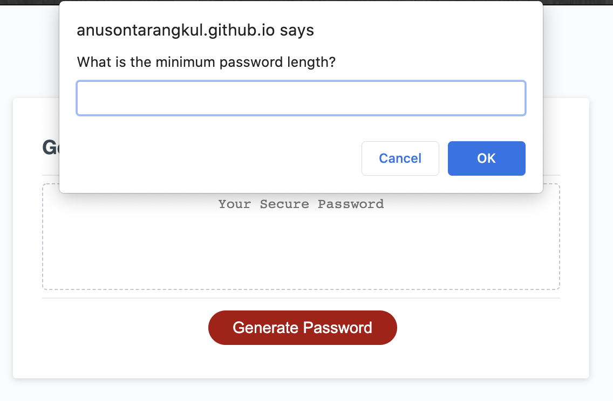

# Password Generator

This app helps you generage a unique password. You begin by clicking "generate password." You are prompted to answer different questions to create the criteria for the password. Each input is validated to make sure that it is valid. Once all the prompts are successfully completed, a new password is displayed.





## Table of Contents

|                                             |                                                               |                                                   |
| :-----------------------------------------: | :-----------------------------------------------------------: | :-----------------------------------------------: |
| [Project Introduction](#Password-Generator) |            [Table of Contents](#table-of-contents)            | [Development Highlights](#development-highlights) |
|           [Deployment](#deployed)           | [Description of Page Building](#Description-of-Page-Building) |       [Code Hightlights](#code-highlights)        |
|   [Technologies Used](#Technologies-Used)   |                      [Credits](#Credits)                      |                [License](#License)                |

## Development Highlights

- Window object prompts and alerts
- Validate input with conditions
- Random number generator
- Random index from array

## Deployed

[Deployment](https://anusontarangkul.github.io/password-generator-2.0/)
This app is deployed using GitHub pages.

## Description of Page Building

- .gitignore
- index.html
- LICENSE
- README
- script.js
- style.css
- Screenshots
  - screenshots for README

## Code Highlights

Looping the length of the password length and pushing a random character from the possible characters into the "pass" array. The "pass" array is later joined as a string. Arrays are used instead of strings to improve efficiency.

```JavaScript
  for (let i = 0; i <= passlength; i++) {
    let randomChar = possibleChars[Math.floor(Math.random() * possibleChars.length)];
    pass.push(randomChar);
  }
```

Function to let users enter the minimum length of the password. We store the user input to a variable and then change the input to an integer. Next, the input is validated. If the input isn't entered or a non number was entered, an alert will tell the user to enter a valid number. A recursive call on the function happens next. The condition also checks that the length is at least 9 characters long. If the input passes the validation, the global variable is updated.

```JavaScript
function findLengthMin() {
  // prompt user to enter
  let passwordMin = window.prompt("What is the minimum password length?");
  passwordMin = parseInt(passwordMin);

  // validate minimum
  if (!passMin || typeof passwordMin !== "number") {
    window.alert("Please enter a valid number.");
    findLengthMin()
  } else if (passwordMin < 8) {
    window.alert("Password needs to be a minimum of 8 characters. Try again.");
    findLengthMin()
  }

  //update global
  passMin = passwordMin;

}
```

An array for each character type is created. If the user says yes to a character type, they get added to the possibleChars array. JavaScript spread operater is used to concate.

```JavaScript
  if (allowLowerCase) {
    possibleChars = [...possibleChars, ...lowerCaseChar];

  }

  if (allowUpperCase) {
    possibleChars = [...possibleChars, ...upperCaseChar];
  }

  if (allowNumbers) {
    possibleChars = [...possibleChars, ...numbersChar];
  }

  if (allowSpecial) {
    possibleChars = [...possibleChars, ...specialChar];
  }
```

## Technologies Used

- [HTML](https://www.w3schools.com/html/)
- [JavaScript](https://www.javascript.com/)
- [CSS](https://www.w3schools.com/css/)

The HTML and CSS as already given as starter files.

## Credits

|                           |                                                                                                                                                                                                       |
| ------------------------- | ----------------------------------------------------------------------------------------------------------------------------------------------------------------------------------------------------- |
| **David Anusontarangkul** | [ LinkedIn](https://www.linkedin.com/in/anusontarangkul/) [ GitHub](https://github.com/anusontarangkul) |

## License

[](https://opensource.org/licenses/MIT)
